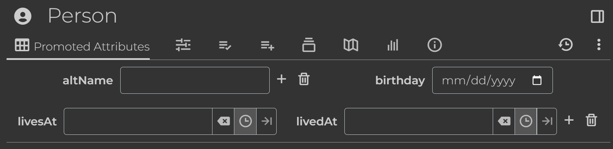

# TriliumAlchemy

[](https://pypi.org/project/trilium-alchemy)
[](https://pypi.org/project/trilium-alchemy)
[]()
[]()
[](https://github.com/psf/black)
[](https://pepy.tech/project/trilium-alchemy)

Python SDK for [Trilium Notes](https://github.com/zadam/trilium). More features are planned, such as a CLI toolkit for extension management, exporting/importing, and more.

- [TriliumAlchemy](#triliumalchemy)
  - [Documentation](#documentation)
  - [Getting started](#getting-started)
  - [Working with notes](#working-with-notes)
  - [Pythonic note interfaces](#pythonic-note-interfaces)
    - [Single-valued label accessor](#single-valued-label-accessor)
    - [Entity bind operator: `+=`](#entity-bind-operator-)
    - [Clone operator: `^=`](#clone-operator-)
    - [Content](#content)
    - [Custom attribute accessors](#custom-attribute-accessors)
  - [Declarative notes: Notes as code](#declarative-notes-notes-as-code)
    - [Note subclasses](#note-subclasses)
    - [Setting fields](#setting-fields)
    - [Adding attributes](#adding-attributes)
      - [Icon helper](#icon-helper)
      - [Promoted attributes](#promoted-attributes)
    - [Adding children](#adding-children)
    - [Mixin subclasses](#mixin-subclasses)
  - [Setting content from file](#setting-content-from-file)

## Documentation

Read the full documentation here: <https://mm21.github.io/trilium-alchemy/>

## Getting started

This guide assumes you have some familiarity with Trilium itself; namely the basic concepts of [notes](https://github.com/zadam/trilium/wiki/Note), [attributes](https://github.com/zadam/trilium/wiki/Attributes), and [branches](https://github.com/zadam/trilium/wiki/Tree-concepts).

Install from PyPI:

```bash
pip install trilium-alchemy
```

To connect to a Trilium server, you need to supply either an ETAPI token or password. A token is the recommended mechanism; create a new token in Trilium's UI from Options &rarr; ETAPI. If you provide a password, a temporary token is created for you.

In TriliumAlchemy, the `Session` class is the fundamental interface to interact with Trilium. It implements a [unit of work](https://martinfowler.com/eaaCatalog/unitOfWork.html) pattern, much like [SQLAlchemy's `Session`](https://docs.sqlalchemy.org/en/20/orm/session.html). (In fact, the design for this project was based heavily on SQLAlchemy and therefore inspired its name as well.)

As you make changes to Trilium objects, their state is maintained in the `Session` to which they belong. When you're done making changes and invoke `Session.flush()`, the unit of work dependency solver determines the order in which to commit changes to Trilium and commits them. For example, new notes need to be created before their attributes.

Below is an example of how to create a `Session`:

```python
from trilium_alchemy import Session

# your host here
HOST = "http://localhost:8080"

# your token here
TOKEN = "my-token"

session = Session(HOST, token=TOKEN)
```

Once you're done making changes, simply commit them to Trilium using `Session.flush()`:

```python
session.flush()
```

The `Session` implements a context manager which automatically invokes `flush()` upon exit. For example:

```python
with Session(HOST, token=TOKEN) as session:

    # create a new note under root
    note = Note(title="My note", parents=session.root)

    # session.flush() will be invoked automatically
```

## Working with notes

See the full documentation here: <https://mm21.github.io/trilium-alchemy/sdk/guide/working-with-notes/index.html>

There are 3 kinds of objects in Trilium, represented in TriliumAlchemy as the following classes:

- `Note`
- `BaseAttribute` base class, with concrete classes `Label` and `Relation`
- `Branch`, linking a parent and child note

Once you have a `Session`, you can begin to interact with Trilium. The first `Session` created is registered as the default for any subsequent Trilium objects created.

The following shows an example of creating a new note under today's [day note](https://github.com/zadam/trilium/wiki/Day-notes):

```python
with Session(HOST, token=TOKEN) as session:

    # get today's day note
    today = session.get_today_note()

    # create a new note under today
    note = Note(title="New note about today", parents=today)

    # add some content
    note.content = "<p>Hello, world!</p>"
```

## Pythonic note interfaces

This project implements idiomatic interfaces for working with notes.

### Single-valued label accessor

Values of single-valued attributes can be accessed by indexing into the note itself. For example:

```python
note["myLabel"] = "myValue"
assert note["myLabel"] == "myValue"
```

This creates the label `myLabel` if it doesn't already exist.

### Entity bind operator: `+=`

Use `+=` to add a `Label`, `Relation`, `Branch` (parent or child), or child `Note`.

Add a label:

```python
note += Label("myLabel")
assert note.labels.get_value("myLabel") == ""
```

Add a relation:

```python
note += Relation("myRelation", session.root)
assert note.relations.get_target("myRelation") is session.root
```

Add a child branch implicitly with empty prefix:

```python
note += Note(title="Child note")
assert note.children[0].title == "Child note"
```

Add a child branch implicitly with prefix specified as `tuple[Note, str]`:

```python
note += (Note(title="Child note"), "My prefix")
assert note.children[0].title == "Child note"
```

Or equivalently, explicitly create a child branch:

```python
child = Note(title="Child note")
note += Branch(child=child, prefix="My prefix")

assert note.branches.children[0].prefix == "My prefix"
assert note.children[0] is child
```

Similarly, explicitly create a parent branch:

```python
note += Branch(parent=session.root, prefix="My prefix")
assert note.branches.parents[0].prefix == "My prefix"
```

### Clone operator: `^=`

Use `^=` to add another note as a parent, cloning it:

```python
# get today's day note
today = session.get_today_note()

# clone to today
note ^= today

assert note in today.children
assert today in note.parents
```

Specify a branch prefix by passing a `tuple[Note, str]`:

```python
note ^= (today, "My prefix")
```

### Content

To access note content, get or set `Note.content`. Content type should be `str` if `Note.is_string` is `True`, and `bytes` otherwise.

```python
note = Note()
note.content = "<p>Hello, world!</p>"

assert note.content == "<p>Hello, world!</p>"
```

For type-safe access, use `Note.content_str` or `Note.content_bin`:

```python
note = Note()
note.content_str = "<p>Hello, world!</p>"

assert note.content_str == "<p>Hello, world!</p>"
```

Type-safe accessors will raise `ValueError` if the content is not of the expected type as determined by `Note.is_string`.

### Custom attribute accessors

Use a `Note` subclass to implement custom interfaces, for example attribute accessors:

```python
class MyNote(Note):
    
    @property
    def my_label(self) -> str:
        return self.labels.get_value("myLabel")
    
    @my_label.setter
    def my_label(self, val: str):
        self.labels.set_value("myLabel", val)

note = MyNote(title="My note")

note.my_label = "my_value"
assert note.my_label == "my_value"
```

## Declarative notes: Notes as code

One of the goals of this project is to enable building, maintaining, and sharing complex note hierarchies using Python. This approach is declarative in nature, inspired by SQLAlchemy's [declarative mapping](https://docs.sqlalchemy.org/en/20/orm/mapping_styles.html#orm-declarative-mapping) approach.

The general idea of declarative programming is that you specify the desired end state, not the steps needed to reach it.

For a fully-featured example of a note hierarchy designed using this approach, see [Event tracker](https://mm21.github.io/trilium-alchemy/sdk/declarative-notes/event-tracker.html).

### Note subclasses

The basic technique is to subclass `BaseDeclarativeNote`:

```python
class MyNote(BaseDeclarativeNote):
    pass
```

When you subclass {obj}`BaseDeclarativeNote`, you're saying that attributes and child branches will be maintained by the class definition itself. Therefore any existing attributes or children will be deleted or modified to reflect the class.

### Setting fields

Set the corresponding `Note` fields upon instantiation by setting attributes suffixed with `_`:

- `title_`
- `note_type_`
- `mime_`
- `content_`

For example:

```python
class MyNote(BaseDeclarativeNote):
    title_ = "My title"
    note_type_ = "text"
    mime_ = "text/html"
    content_ = "<p>Hello, world!</p>"
```

### Adding attributes

To add attributes, use the decorators `label` and `relation`:

```python
class Root(BaseDeclarativeNote):
    note_id_ = "root"

@label("myLabel")
@relation("myRelation", Root)
class MyNote(BaseDeclarativeNote):
    pass

my_note = MyNote()
```

This is equivalent to the following imperative approach:

```python
my_note = Note()
my_note += [
    Label("myLabel"),
    Relation("myRelation", Note(note_id="root")),
]
```

#### Icon helper

To set an icon (label `#iconClass`), simply set the `icon` attribute:

```python
class MyTask(BaseDeclarativeNote):
    icon = "bx bx-task"
```

#### Promoted attributes

A special type of label is one which defines a [promoted attribute](https://github.com/zadam/trilium/wiki/Promoted-attributes). Decorators `label_def` and `relation_def` are provided for convenience.

The following creates a workspace template with an icon and a few promoted attributes:

```python
@label("person")
@label_def("altName", multi=True)
@label_def("birthday", value_type="date")
@relation_def("livesAt")
@relation_def("livedAt", multi=True)
class Person(BaseWorkspaceTemplateNote):
    icon = "bx bxs-user-circle"
```



### Adding children

Use `children` or `child` to add children:

```python
class Child1(BaseDeclarativeNote): pass
class Child2(BaseDeclarativeNote): pass
class Child3(BaseDeclarativeNote): pass

@children(Child1, Child2) # add children with no branch prefix
@child(Child3, prefix="My prefix") # add child with branch prefix
class Parent(BaseDeclarativeNote): pass
```

### Mixin subclasses

Sometimes you want to logically group and reuse attributes and/or children, but don't need a fully-featured `BaseDeclarativeNote`. In those cases you can use a `BaseDeclarativeMixin`.

The basic technique is to subclass `BaseDeclarativeMixin`:

```python
@label("sorted")
class SortedMixin(BaseDeclarativeMixin):
    pass
```

Now you can simply inherit from this mixin if you want a note's children to be sorted:

```python
class MySortedNote(BaseDeclarativeNote, SortedMixin):
    pass
```

## Setting content from file

Set note content from a file by setting `content_file`:

```python
class MyFrontendScript(BaseDeclarativeNote):
    note_type_ = "code"
    mime_ = "application/javascript;env=frontend"
    content_file = "assets/myFrontendScript.js"
```

The filename is relative to the package or subpackage the class is defined in. Currently accessing parent paths (`".."`) is not supported.
